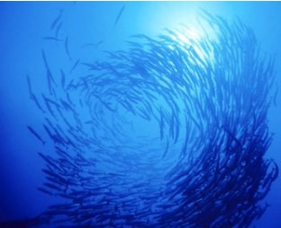
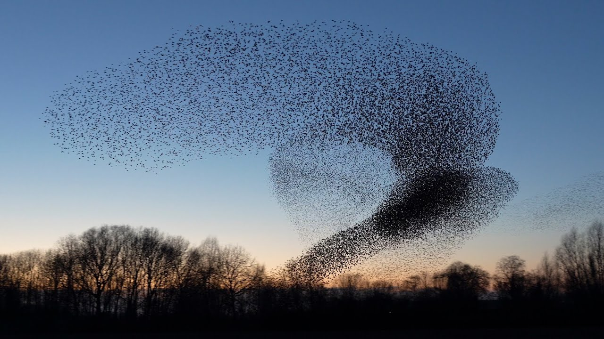

# Starling Murmurations Simulation

## Auteur

- [Alexandre Jeunot-Caire](https://github.com/jeunotca)

## Visuel


## Description

Programme <b>personnel</b> développé en `Javascript` afin de développer mes compétences dans ce langage tout en m'initiant aux essaims de robots en simulant un banc de poissons ou la murmuration d'étourneaux. Ce travail est basé sur les travaux de recherches de **Craig W. Reynolds** en 1986.




### Règles

L'idée est que chaque robot, appelé **Boid** (pour Bird-oid) doit suivre quelques simples règles :
- Essayer d'éviter les obstacles (en l'occurence, les bords)
- Essayer d'éviter la collision avec les autres boids qui s'approcheraient trop près de lui
- Essayer de s'aligner avec les boids voisins
- Essayer d'accorder sa vitesse avec les boids voisins

En outre, j'ai ajouté une quatrième règle :
- En présence d'un prédateur, essayer de l'éviter


## Installation

### Récupération des sources

* Depuis l'invité de commandes (HTTP):
```bash
$ git clone https://github.com/jeunotca/starling-murmurations-simulation.git
$ cd starling-murmurations-simulation.git
```

### Dépendances

Ce programme a été réalisé à l'aide de :
- [p5.js](https://p5js.org/)

## Prédateur

Le prédateur est matérialisé par **le curseur de votre souris**. Pour l'activer ou le désactiver, il suffit de cliquer (gauche). Vous verrez si le prédateur est présent grâce au disque rouge qui apparaîtra autour du curseur.


## Utilisation

### Exécution du projet

Il suffit d'ouvrir `index.html` dans votre navigateur favori !

### Live demo

Vous pouvez trouver une démonstration de ce programme sur mon site : https://jeunot-caire.fr/projects/boids-simulation/

## Remerciements

- [Fouloscopie](https://www.youtube.com/channel/UCLXDNUOO3EQ80VmD9nQBHPg) pour l'idée du projet
